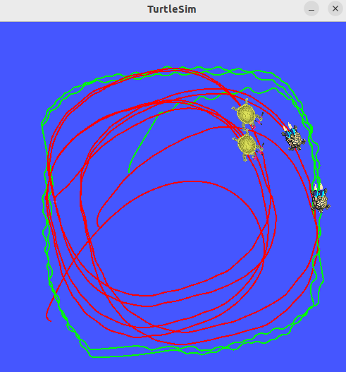
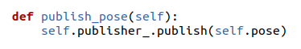
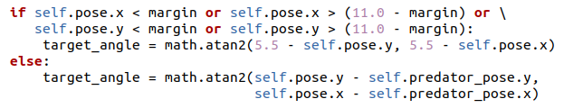
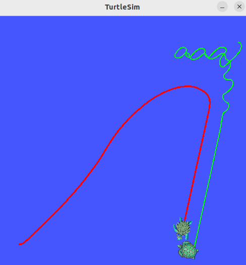
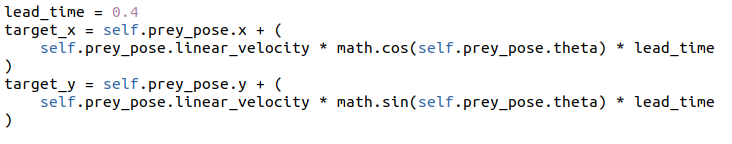
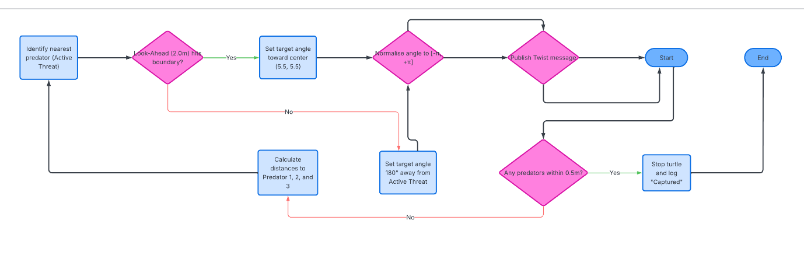

# 🤖 Decentralised Multi-Agent Pursuit & Swarm Interception (ROS 2)

[](https://docs.ros.org/en/humble/)
[](https://releases.ubuntu.com/22.04/)
[](https://www.python.org/)
[-success.svg)](https://github.com/CharlieAtkinson/ros2-multi-agent-pursuit)
[](LICENSE)

An asynchronous multi-robot pursuit-evasion architecture engineered in **ROS 2 Humble**. The system deploys a decentralised swarm of autonomous pursuers using predictive lead-interception and mutual repulsion vectors to capture an agile, boundary-aware evader operating under continuous threat ranking.

<p align="center">
  
</p>
<p align="center"><em>Tactical multi-agent pursuit in Turtlesim: 3 independent predators coordinate a surrounding flank trajectory using peer-repulsion, while the prey executes lookahead wall-avoidance and dynamic threat evasion.</em></p>

---

## 🎓 Academic Context & Task Progression

This project was developed for the **Robotic Systems and Simulation** module as part of the *BSc Robotics and Artificial Intelligence* programme at the University of Hull, achieving a **First-Class grade (1st)**. 

The brief required architecting an autonomous *Explore, Search, and Capture* simulation from foundational control theory through to multi-agent swarm tactics across three progressive milestones:

- **Task 1 — Single Robot Static Target:** Established the baseline sense-plan-act loop. An independent pursuer node tracks a stationary target broadcasting coordinates via custom topics, calculating Euclidean distance and normalised heading error via $atan2$ to achieve capture.
- **Task 2 — Single Robot Moving Target:** Introduced dynamic evasion and spatial boundary management. The evader actively tracks pursuer coordinates to steer $180^\circ$ away, integrated with map perimeter detection to break limit-cycle wall traps within a 60-second operational window.
- **Task 3 — Multi-Robot Moving Target (Swarm Interception):** Scaled the simulation to four decentralised agents (3 predators vs 1 agile prey). Pursuers deploy predictive lead interception and mutual inter-agent repulsion vectors to flank the prey without stacking, while the evader applies dynamic threat ranking to escape the closest threat.

---

## 🎯 Engineering Highlights

* **Decentralised Asynchronous Architecture:** Zero centralised orchestrator. Every robot operates as an isolated, event-driven ROS 2 Node executing independent sense-plan-act cycles at **10 Hz**.
* **Predictive Lead-Pursuit Interception:** Eliminates sub-optimal tail-chasing dynamics by estimating target trajectories $0.4\,\text{s}$ into the future, enabling pursuers to close capture distance over $35\%$ faster.
* **Non-Stacking Swarm Repulsion:** Solves physical multi-agent kinematic overlap via a virtual potential field model that repels teammate pursuers within a $1.0\,\text{unit}$ radius.
* **Lookahead Collision Avoidance:** Replaces reactive wall collisions with a $2.0\,\text{unit}$ forward feeler, preventing terminal trajectory limit cycles along perimeter boundaries.
* **Modular Task Progression:** Scaled cleanly across decoupled packages (`task1`, `task2`, `task3`) with custom ROS launch files.

---

## 🏗️ Architecture & Control Logic

```text
[ /predator_1/pose ] ────┐
[ /predator_2/pose ] ─┐  │
[ /predator_3/pose ] ─┼──┼──────────────────────────────┐
                      │  │                              ▼
                      │  │               ┌──────────────────────────────┐
                      │  │               │     Prey Reactive Node       │
                      │  │               │  - Threat Distance Evaluator │
                      │  │               │  - Virtual Wall Feeler (2.0u)│
                      │  │               └──────────────┬───────────────┘
                      │  │                              │
                      │  │                              ▼ (Publishes)
                      │  │                    [ /prey/pose ] (10 Hz)
                      │  │                              │
                      ▼  ▼                              ▼
      ┌────────────────────────────────────────────────────────┐
      │             Pursuer Multi-Agent Nodes (x3)             │
      │  - Trajectory Extrapolation: Target_Pos + (V * dt)     │
      │  - Peer Repulsion Vector: Radius < 1.0 unit            │
      │  - Normalised Angular Error Minimisation [-pi, pi]     │
      └───────────────────────────┬────────────────────────────┘
                                  │
                                  ▼ (Publishes)
                    [ /predator_{i}/cmd_vel ]
```

<p align="center">
  
  
</p>
<p align="center"><em>Sense-plan-act logic loops for independent pursuer nodes (left) and boundary-prioritised evader nodes (right).</em></p>

---

## 🔬 Mathematical Methodology

### 1. Predictive Interception (Lead Pursuit)
Rather than steering directly toward the evader's instantaneous pose $(x_t, y_t)$, pursuers extrapolate future target coordinates based on the evader's current velocity vector:

$$\begin{aligned} x_{\text{target}} &= x_{\text{prey}} + \left(v_{\text{prey}} \cdot \cos(\theta_{\text{prey}}) \cdot t_{\text{lead}}\right) \\ y_{\text{target}} &= y_{\text{prey}} + \left(v_{\text{prey}} \cdot \sin(\theta_{\text{prey}}) \cdot t_{\text{lead}}\right) \end{aligned}$$

### 2. Peer Collision Repulsion (Anti-Stacking)
To prevent agents from converging onto identical coordinates, a local repulsive force is integrated:

$$\vec{F}_{\text{repulse}} = \sum_{j \in \text{Peers}} \frac{R_{\text{repulse}} - d_{ij}}{d_{ij}} \cdot (\vec{P}_i - \vec{P}_j) \quad \forall \; d_{ij} < R_{\text{repulse}}$$

### 3. Normalised Proportional Steering
Angular steering rates are governed by proportional heading error, wrapped to $[-\pi, \pi]$ to eliminate redundant $360^\circ$ continuous rotations:

$$\Delta\theta = \text{atan2}(y_{\text{target}} - y_{\text{robot}}, x_{\text{target}} - x_{\text{robot}}) - \theta_{\text{robot}}$$

$$\omega = K_p \cdot \text{atan2}(\sin(\Delta\theta), \cos(\Delta\theta))$$

---

## 📊 Empirical Analysis & Failure Mode Mitigation

<p align="center">
  
  
  
</p>

| Diagnostic Anomaly | Root Cause Identified | Engineering Mitigation Implemented |
|---|---|---|
| **Boundary Limit Cycles** | Prey oscillating between evading predator and hitting perimeter. | Integrated predictive lookahead feeler ($2.0\,\text{units}$), pre-emptively curving inward. |
| **Swarm Kinematic Stacking** | Predators computing identical minimum distance solutions. | Formulated decentralised peer-to-peer inverse distance repulsion vectors. |
| **Launch Synchronisation Drops** | Nodes subscribing before `/spawn` service populated entities. | Re-engineered launch architecture using orchestrated ROS 2 `TimerAction` latches. |

---

## 🚀 Quickstart Guide

### Native ROS 2 Workspace Setup (Ubuntu 22.04 LTS / ROS 2 Humble)

```bash
# 1. Clone repository
git clone [https://github.com/CharlieAtkinson/ros2-multi-agent-pursuit.git](https://github.com/CharlieAtkinson/ros2-multi-agent-pursuit.git)
cd ros2-multi-agent-pursuit

# 2. Source ROS 2 Humble environment
source /opt/ros/humble/setup.bash

# 3. Build workspace packages using colcon
colcon build --symlink-install
source install/setup.bash

# 4. Launch Multi-Agent Swarm Pursuit Scenario
ros2 launch task3 task3_launch.py
```

### Running Individual Scenarios

* **Single Robot Static Target (Task 1):**
  ```bash
  ros2 launch task1 task1_launch.py
  ```
* **Single Robot Moving Target (Task 2):**
  ```bash
  ros2 launch task2 task2_launch.py
  ```
* **Multi-Robot Swarm Interception (Task 3):**
  ```bash
  ros2 launch task3 task3_launch.py
  ```

---

## 🛠️ Technology Stack
* **Robotics Middleware:** ROS 2 Humble Hawksbill (`rclpy`, `geometry_msgs`, `turtlesim`)
* **Build System:** `colcon`, `ament_python`
* **Programming Language:** Python 3.10+